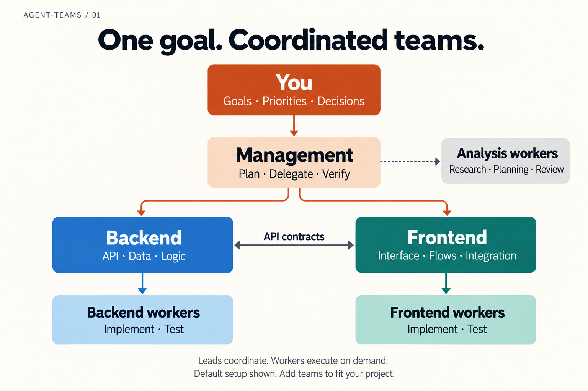
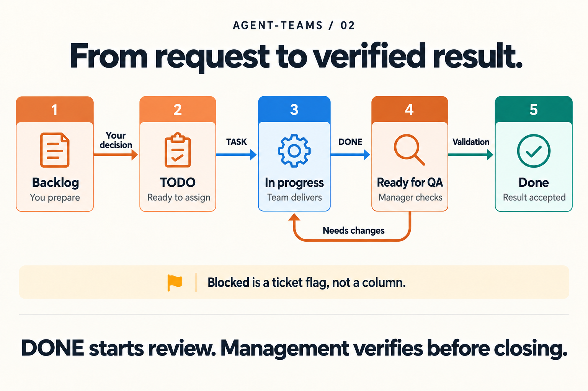
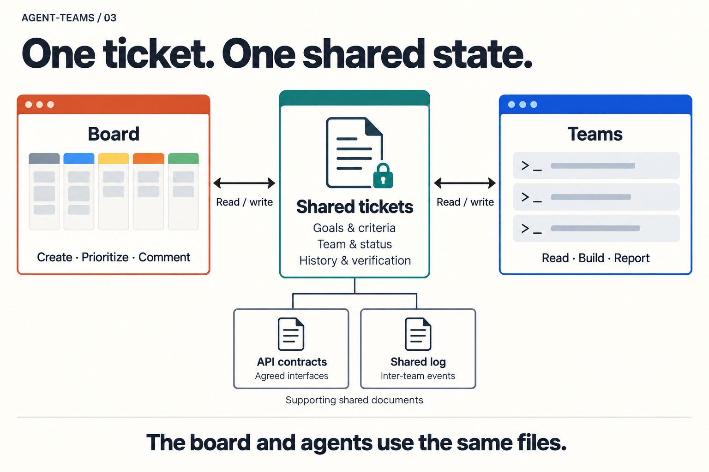

# agent-teams

**One goal. Coordinated teams. Verified work.**

Run several Claude Code sessions as coordinated teams on one project. A manager plans with you, assigns tickets and verifies delivery; specialized teams (backend, frontend, whatever your project needs) implement through cheap workers. A live board and shared ticket files keep the work visible from the first idea to the final check. Messages between teams are one line each, so coordination costs almost no tokens.

[Quick start](#quick-start) · [Demo](#try-the-demo) · [How it works](#how-it-works) · [Your project](#use-it-on-your-project) · [Terminals](#terminals) · [Follow a ticket](#from-request-to-verified-result) · [Commands](#everyday-commands) · [Reference](docs/REFERENCE.md)

---

## Quick start

You need **Python 3.10 or newer**, an authenticated **Claude Code** CLI, and a terminal multiplexer: **[Programa](https://github.com/darkroomengineering/programa)** or **tmux**. Without either, `teams up` prints the commands to run by hand.

Claude Code's agent-team messaging is experimental: enable it once in `~/.claude/settings.json`.

```json
{ "env": { "CLAUDE_CODE_EXPERIMENTAL_AGENT_TEAMS": "1" } }
```

**1. Install the engine once.** One clone, one symlink, no package to manage. `git pull` later upgrades every project.

```bash
git clone git@github.com:benoitdelorme/agent-teams.git ~/agent-teams
~/agent-teams/install.sh        # symlinks `teams` into ~/.local/bin (or /usr/local/bin when ~/.local/bin does not exist); pass another directory if you prefer
teams --help
```

**2. Create the instance in your project.**

```bash
cd ~/code/my-project
teams init                      # analyses the project, proposes the teams, writes ./.teams once you say yes
```

**3. Launch and talk to the manager.**

```bash
teams up                        # one terminal per team, Claude started in each, board started, manager selected
```

Describe a concrete outcome with its acceptance criteria. The manager writes tickets, dispatches them, and reports back when the work is verified. `teams down` stops everything.

## Try the demo

The repository ships **Milestone**, a small project tracker (a FastAPI backend, a React frontend) with a ready instance:

```bash
cd ~/agent-teams/examples/demo
teams up
```

Ask the manager for a project-archiving feature and watch the tickets move on the board. The [demo README](examples/demo/README.md) suggests three features of increasing size and explains how to run the two applications when a task needs a live API or browser.

## How it works

You work with the **manager**, the team marked `primary` in the configuration. It turns your request into a plan, assigns tickets and checks the results. Specialized teams own delivery in their respective areas.

Each enabled team is its own Claude Code session in its own terminal, with its own working directory and instructions. Workers are native Claude Code sub-agents launched by their lead for one bounded assignment.

[](docs/images/team-hierarchy.png)

| Role | Responsibility | What it hands over |
| --- | --- | --- |
| **You** | Set the goal, choose priorities and settle product decisions. | A desired outcome and acceptance criteria. |
| **Manager** · `manager` | Plan, assign work, resolve blockers and verify delivery. Its workers help with research, planning and review. | Scoped tickets and a checked result. |
| **Backend** · `backend` | Own APIs, data and server-side behavior. Agree on interfaces with Frontend. | Tested behavior and a matching API contract. |
| **Frontend** · `frontend` | Own screens, interaction and integration with the agreed API. | Working user flows, checked against the project's build and acceptance criteria. |
| **Workers** | Execute a bounded assignment from their lead. | Changed files, verification results and any remaining issue. |

### Leads and workers are different jobs

A **team** is a continuing area of responsibility. A **worker** is a helper for one piece of work inside that team. Adding a worker profile gives a lead another capability; adding a team creates another independently addressable lead and terminal.

| Assignment | Default model | Best fit |
| --- | --- | --- |
| Team lead | Opus 5.5 | Planning, decisions, delegation and verification. |
| `worker-simple` | Sonnet 5 | Precise, limited tasks such as a component, test, small fix or documentation change. |
| `worker-complex` | Opus 5.5 | Investigation, refactoring, migrations and work requiring local design decisions. |

These assignments are configurable globally and per team. Leads choose the least expensive worker suited to the task and escalate when the work requires it. Independent assignments run in parallel.

A useful worker brief contains four things: **the goal, the exact scope, acceptance criteria and a verification command**. The worker returns a compact report so the lead can review the result without reconstructing the whole task.

### Engine and instances

This repository is the **engine**: launcher, board, protocol, default role prompts and worker profiles. It is cloned once, put on your PATH once, and never edited for a given project.

Each project gets its own **instance**: a `.teams/` directory holding that project's `teams.json`, its role prompts, the generated repository rules, the tickets and the runtime state. One swarm of teams per project, independent from the others.

```
~/agent-teams/                 the engine; `teams` on your PATH points here
~/code/my-project/
  .teams/
    teams.json                 teams, workers, models, language, terminal, board
    prompts/manager.md …       this project's role prompts
    rules/                     repository digests + your .local.md notes
    shared/tasks/T7.md …       tickets
    .state/                    sessions, notifications (gitignored)
```

Every command is `teams <something>`, run from anywhere inside the project: the instance is found by walking up from the current directory. The Claude sessions receive the instance path in their environment, so the agents run the same commands.

`init` copies the role prompts into the instance so you can edit them; any file under the instance's `prompts/` or `workers/` overrides the engine file of the same name, and deleting a copy falls back to the engine default. The instance records the engine version it was created with and `teams up` warns when they differ. A project that needs to pin a version adds the engine as a git submodule at `.teams/engine`; the global command hands over to it automatically.

## Use it on your project

`teams init` sends one cheap model call (Sonnet 5, a few thousand tokens) a snapshot of the project: the directory tree, the manifests, the READMEs and the files that reveal how the parts connect (dev-server proxies, compose files, workspaces). The model proposes the teams with their directory, purpose, stack, verification commands and the interfaces between them, with the file that justifies each one. You see the proposal and confirm before anything is written; `--dry-run` only shows it, `--yes` skips the question. Each team gets the engine's role prompt for its kind plus a short section with what the analysis found.

Without a model (`--no-ai`, or when `claude` is not available) the applications are detected from their manifests instead. Pass repository paths to analyse specific directories, `--language French` to have the leads talk to you in another language, `--dir` to name the instance directory (its parent is taken as the project root; only `.teams/` and `teams/` are found automatically, any other name needs `TEAMS_CONFIG`).

Then:

1. **Review `.teams/teams.json`.** Working directories, titles, purposes, models and workers.
2. **Edit `.teams/prompts/*.md`.** Ownership boundaries, verification steps, completion criteria. Keep what the defaults get right.
3. **Optionally run `teams learn all`.** One cheap model call per execution team (the manager has no repository to learn) summarizes the repository's rules and commands into `.teams/rules/<team>.md`. Your own notes go in `.teams/rules/<team>.local.md` and are never overwritten. The project's `CLAUDE.md` still wins on conflict.
4. **Launch with `teams up`** and give the manager a task.

Commit `.teams/` with the project. Runtime state is ignored; tickets are ignored by default, with a two-line change in `.teams/.gitignore` to version them.

By default `teams up` marks the team directories as trusted in `~/.claude.json` so no dialog blocks a terminal. Set `trust_dirs` to `false` in `teams.json` to keep that manual.

### Add a team

```bash
teams add qa --cwd qa --purpose "Acceptance checks and regression testing"   # --cwd is relative to your shell
```

This registers the team and creates `.teams/prompts/qa.md` from the template. Complete the prompt, review the entry in `teams.json`, then restart the teams. Keep exactly one team marked `primary`. Team names use lowercase letters, digits and hyphens. Set `enabled` to `false` to keep a team's configuration without launching it.

Design, mobile, data, infrastructure, QA, documentation: any clearly bounded responsibility can be a team. Useful parallelism depends on separable work, machine resources and Claude usage limits. Use worker delegation when the extra work belongs inside an existing team.

## Terminals

Each team lives in its own terminal. The launcher picks the terminal driver automatically, or you set `terminal` in `teams.json`:

| Driver | When | What `teams up` does |
| --- | --- | --- |
| `programa` | you run `teams up` inside Programa | One named workspace per team, the board in a tab beside the manager, the manager's workspace selected. |
| `tmux` | tmux is installed | One detached session per project (`teams-<project>`), one window per team, one for the board. `teams up` prints how to attach. |
| `manual` | neither is available | Prints the exact command to run in each terminal and starts the board detached; the board cannot wake the manager and `teams msg` is unavailable. |

`teams up --dry-run` prints the commands with any driver and starts nothing.

`teams status`, `teams msg`, `teams down` and the board reuse the driver recorded by `teams up`. Programa and tmux behave the same from the agents' point of view.

## From request to verified result

There are two ways to introduce work:

- **Talk to the manager.** Describe the outcome and agree on the scope. It creates actionable tickets and assigns them to the right teams.
- **Use the board.** Capture an idea in Backlog, refine its description and criteria, then move it to TODO when you want the manager to take it forward.

Backlog stays under your control. Moving a board ticket to TODO queues a notification for the manager.

[](docs/images/ticket-lifecycle.png)

| Stage | Meaning | What moves it forward |
| --- | --- | --- |
| **Backlog** · `backlog` | An idea being prepared by you. | You move it to TODO. |
| **TODO** · `todo` | Ready for the manager to refine and assign. | A successful TASK message assigns the team and starts work. |
| **In progress** · `doing` | The responsible team and its workers are delivering the task. | The team reports DONE with its evidence. |
| **Ready for QA** · `qa` | Delivery is ready for the manager's acceptance check. | The manager records its check and closes or returns the ticket. |
| **Done** · `done` | The result has passed the final check. | Work is complete for the recorded criteria. |

**A DONE message starts review. It does not close the ticket.** The manager owns the acceptance decision. A failed check returns the ticket to implementation with a note explaining what needs correction. A blocker is a **flag on the ticket**, so the ticket keeps its place while the missing input is resolved.

### A concrete example

Suppose you ask for a project-archiving feature.

The manager defines the expected behavior and separates API work from interface work. Backend records the endpoint, request, response and error cases in the shared contract. Frontend agrees on that interface and prepares its UI against the agreed shape while Backend implements it.

Each lead delegates the work and checks its workers' output. The teams report their changed files and verification results. The manager then checks the acceptance criteria, including the interface against the real endpoint, before closing the tickets. A green component build alone cannot establish that the feature works across both applications.

## Shared files keep everyone aligned

The board, the command-line tools and the message hooks all work with the **same ticket files**. You can read the goal, ownership, progress and evidence without searching several conversations.

[](docs/images/shared-state.png)

| Reference | What belongs there |
| --- | --- |
| `.teams/shared/tasks/` | One Markdown file per task, such as `T7.md`: description, acceptance criteria, team, status and history. |
| `.teams/shared/CONTRACTS.md` | Agreed API shapes and integration details. Created when a contract is needed. |
| `.teams/shared/PLAN.md` | An optional short overall goal and pointer to the contracts. |
| `.teams/shared/LOG.md` | Inter-team messages and lifecycle events. |
| `.teams/prompts/` | Responsibilities, ownership boundaries and delivery expectations. |
| `.teams/rules/` | Generated repository summaries and your handwritten local guidance. |

Tickets also carry optional **scope, verification, decision references and dependencies**, editable on the board and through the CLI. They are instructions for the agents, not a scheduler or an access control.

Ticket updates use one shared lock across the whole read-modify-write and replace files atomically. The CLI, the board and the hooks share the same validation and writing logic.

### Messages carry the next action

Leads use Claude Code's native messaging to coordinate. Backend and Frontend negotiate API contracts directly; the manager steps in when a decision needs arbitration or the teams cannot converge.

| Message | Purpose |
| --- | --- |
| **TASK** | The manager assigns work to a team. |
| **DONE** | A team submits delivery for review. |
| **BLOCKED** | A team identifies the exact obstacle to progress. |
| **ASK / ANSWER** | Resolve a specific question. |
| **CONTRACT** | Propose or agree on an interface. |
| **STATUS** | Request an exceptional progress check. |

Messages stay short and point to files. Leads wait for replies rather than polling. The [protocol](prompts/PROTOCOL.md) defines the exact format and routing.

Recognized task messages are checked before sending. Ticket changes happen **only after the send succeeds**, and event identifiers prevent a replayed success from applying the same change twice.

## The board is your control surface

The local kanban board gives you a live view of the work and a place to shape it: create, edit, assign and delete tickets, move them through the permitted transitions, refine criteria and work context, comment, filter by id, text or external reference, follow team activity and pending notifications. Each ticket is a page with its own address (`#T7`), so a ticket can be linked from anywhere, and its log colours who is speaking: agents at work, agents done, a blocker that needs you, your own notes.

The board starts with the teams. Its address is printed in the terminal; by default the operating system picks a free local port. Notifications to the manager are saved on disk, retried every five seconds and survive a restart.

## Everyday commands

Run these from anywhere inside the project.

| I want to… | Command |
| --- | --- |
| Start the teams and board | `teams up` |
| Inspect the generated launch commands | `teams up --dry-run` |
| See team activity and ticket progress | `teams status` |
| Resume an interrupted setup | `teams up --resume` |
| Start the board on its own | `teams board` |
| See tokens by team, lead, worker and model | `teams cost` |
| Stop the team terminals and board | `teams down` |
| Create a backlog ticket | `teams task new "Improve the empty state"` |
| Read a ticket | `teams task show T7` |
| List work in progress | `teams task list --status doing` |
| Generate repository guidance | `teams learn all` |
| Refresh one team's guidance | `teams learn frontend --force` |
| Register a new team | `teams add qa --cwd qa` |

The cost command reports token usage from the current run's recorded transcripts. With `prices_per_mtok` configured, it also shows approximate costs.

## Resume, recovery and verification

**Resume preserves the current run.** `up --resume` reuses live sessions, recreates missing terminals and restarts dead sessions with their recorded session IDs. A fresh launch archives the previous session and message records.

**Tickets survive session restarts.** Their files are independent of the running terminals, and so are pending board notifications. After an interruption, inspect the current ticket before dispatching it again.

**Delivery and synchronization are tracked separately.** If a message is sent but its ticket update fails, the event and error are recorded under `.teams/.state/messages/` for inspection. Resolve that discrepancy before resending the assignment.

Automated checks cover ticket concurrency, message routing and replay, session lifecycle, terminal drivers, board notifications, HTTP behavior and permitted UI transitions:

```bash
python3 -B -m unittest discover -s tests -v
node --test tests/board-ui.test.cjs
```

Claude calls and terminal interactions are simulated in the fixtures. A real end-to-end run additionally exercises model access, terminal delivery and the agents' actual handling of the work.

## Find your way around

| Location | Purpose |
| --- | --- |
| [bin/](bin/) | Launcher, ticket operations, message hooks, terminal drivers, shared storage and board server. |
| [prompts/](prompts/) | Shared coordination rules, the protocol and the default team roles. |
| [workers/](workers/) | Default worker profiles. |
| [template/](template/) | Files copied into a new instance by `teams init`. |
| [install.sh](install.sh) | Puts `teams` on your PATH. |
| [tools/board/](tools/board/) | The board interface. |
| [examples/demo/](examples/demo/) | Two sample applications and a ready instance. |
| [docs/REFERENCE.md](docs/REFERENCE.md) | Every command and configuration key, ticket format, files, recovery details. |
| [prompts/PROTOCOL.md](prompts/PROTOCOL.md) | The inter-team message protocol. |
| [docs/BOARD-DESIGN.md](docs/BOARD-DESIGN.md) | Design notes behind the board. |
| [docs/illustrations.md](docs/illustrations.md) | Sources of the README illustrations. |
| [CHANGELOG.md](CHANGELOG.md) | What changed between engine versions. |

## License

MIT
